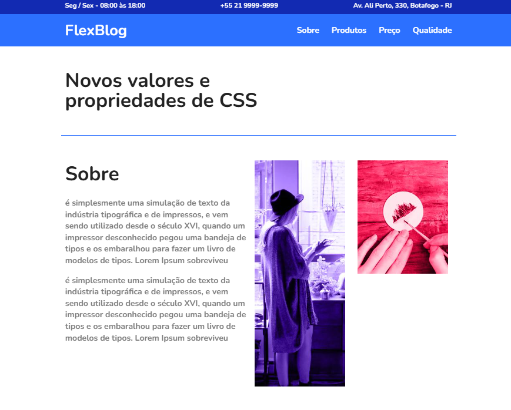

## FlexBlog

Realizei um curso na Origamid sobre CSS Flexbox, onde aprendi técnicas avançadas para criar layouts flexíveis, responsivos e eficientes. Agora sou capaz de utilizar esse poderoso recurso para alinhar, organizar e distribuir elementos com precisão em diferentes projetos web. Estou sempre buscando formas de aplicar esses conhecimentos para melhorar minhas habilidades e entregar soluções modernas e funcionais.

